I'll create a comprehensive system design diagram for your self-hosted services using Mermaid. This will be perfect for your portfolio website.

## System Architecture Diagram

```mermaid
graph TB
    %% Internet & DNS
    INTERNET[Internet Users]
    DNS[Cloudflare DNS]
    
    %% Main Server Hardware
    subgraph "Home Server Hardware"
        SERVER[Home Server]
        HW[Hardware Specs]
        
        subgraph HW
            GPU[Nvidia RTX 3060 12GB]
            CPU[AMD Ryzen 5 5500]
            RAM[32 GB RAM]
            MB[MSI B550M pro-vdh]
            SSD[1TB NVMe M.2 SSD]
        end
    end

    %% Proxmox Hypervisor
    subgraph "Proxmox VE (vps.domain.com)"
        PROXMOX[Proxmox Hypervisor]
        
        subgraph "LXC Containers"
            OLLAMA_CT[Ollama LXC<br/>GPU Passthrough]
            N8N_CT[n8n LXC]
            COMFYUI_CT[ComfyUI LXC<br/>GPU Passthrough]
            GH_RUNNER_CT[GitHub Runner LXC]
            LOCAL_IMG_CT[Local Image LXC<br/>GPU Passthrough]
        end
    end

    %% Ollama Services
    subgraph OLLAMA_CT
        OLLAMA_DOCKER[Docker: Ollama<br/>Port: 11434]
        OPENWEBUI_DOCKER[Docker: Open WebUI<br/>Port: 3000]
        
        subgraph "Ollama Models"
            OLLAMA_MODELS[Llama3.1: 4.9GB<br/>Phi3:14b: 7.9GB<br/>CodeLlama:13b: 7.4GB<br/>Qwen3:14b: 9.3GB<br/>GPT-OSS: 13GB<br/>+10 more models]
        end
    end

    %% n8n Services
    subgraph N8N_CT
        N8N_DOCKER[Docker: n8n<br/>Port: 5678]
        POSTGRES_N8N[Docker: PostgreSQL]
        DASHY_DOCKER[Docker: Dashy<br/>Port: 8080]
        EXCALIDRAW_DOCKER[Docker: Excalidraw<br/>Port: 5000]
        
        subgraph "n8n Workflows"
            WORKFLOWS[Portfolio Chatbot<br/>Schedule Meeting<br/>Summary Emails<br/>Help Desk Tickets<br/>Local RAG Chatbot<br/>Finance Data Collector]
        end
    end

    %% ComfyUI Services
    subgraph COMFYUI_CT
        COMFYUI_WEB[ComfyUI Web Interface<br/>Port: 8080]
        
        subgraph "AI Models & Assets"
            CHECKPOINTS[Checkpoints<br/>- SD v1.5<br/>- SD XL 1.0]
            LORAS[LoRAs<br/>- wan2.2_high_noise<br/>- wan2.2_low_noise]
            VAE[VAE: wan_2.1_vae]
            TEXT_ENC[Text Encoders: umt5_xxl_scaled]
            DIFF_MODELS[Diffusion Models<br/>- wan2.2_high_noise_14B<br/>- wan2.2_low_noise_14B]
        end
    end

    %% GitHub Runner Services
    subgraph GH_RUNNER_CT
        GH_RUNNER[GitHub Actions Daemon]
        
        subgraph "Docker Containers"
            GEN_IMG_FE[Docker: gen-img frontend<br/>Port: 3006]
            SAAS_AI[Docker: SaaS AI Service<br/>Port: 3007]
            UMAMI[Docker: Umami Analytics<br/>Port: 3005]
            POSTGRES_UMAMI[Docker: PostgreSQL]
        end
    end

    %% Local Image Services
    subgraph LOCAL_IMG_CT
        IMG_API[Docker: Image Generator API<br/>Port: 8000]
    end

    %% Web Services & Subdomains
    subgraph "Web Services & Subdomains"
        AI[ai.domain.com → Open WebUI]
        ANALYTICS[analytics.domain.com → Umami]
        DRAW[draw.domain.com → Excalidraw]
        GEN_IMG[gen-img.domain.com → Image Generator]
        IMG_API_DOMAIN[img-api.domain.com → API Service]
        LANDR[landr.domain.com → SaaS AI Service]
        N8N_WEB[n8n.domain.com → n8n]
        OLLAMA_WEB[ollama.domain.com → Ollama]
        PORTFOLIO_OLD[portfolio.domain.com → Old Portfolio]
        PORTAINER[pt.domain.com → Portainer]
        VPS[vps.domain.com → Proxmox]
        WWW[www.domain.com → Current Portfolio]
        CONTACT[contact.domain.com → Gmail]
    end

    %% Connections
    INTERNET --> DNS
    DNS --> SERVER
    SERVER --> PROXMOX
    
    PROXMOX --> OLLAMA_CT
    PROXMOX --> N8N_CT
    PROXMOX --> COMFYUI_CT
    PROXMOX --> GH_RUNNER_CT
    PROXMOX --> LOCAL_IMG_CT
    
    %% Service to Subdomain mappings
    OPENWEBUI_DOCKER --> AI
    UMAMI --> ANALYTICS
    EXCALIDRAW_DOCKER --> DRAW
    GEN_IMG_FE --> GEN_IMG
    IMG_API --> IMG_API_DOMAIN
    SAAS_AI --> LANDR
    N8N_DOCKER --> N8N_WEB
    OLLAMA_DOCKER --> OLLAMA_WEB
    PORTAINER --> PORTAINER
    PROXMOX --> VPS
    WWW --> WWW
    CONTACT --> CONTACT
    
    %% Internal dependencies
    OLLAMA_DOCKER --> OPENWEBUI_DOCKER
    POSTGRES_N8N --> N8N_DOCKER
    POSTGRES_UMAMI --> UMAMI
    COMFYUI_WEB --> IMG_API
    OLLAMA_DOCKER --> WORKFLOWS

    %% Styling
    classDef serverStyle fill:#e1f5fe,stroke:#01579b,stroke-width:2px
    classDef containerStyle fill:#f3e5f5,stroke:#4a148c,stroke-width:1px
    classDef serviceStyle fill:#e8f5e8,stroke:#1b5e20,stroke-width:1px
    classDef webStyle fill:#fff3e0,stroke:#e65100,stroke-width:1px
    classDef gpuStyle fill:#ffebee,stroke:#b71c1c,stroke-width:1px
    
    class SERVER,HW,PROXMOX serverStyle
    class OLLAMA_CT,N8N_CT,COMFYUI_CT,GH_RUNNER_CT,LOCAL_IMG_CT containerStyle
    class OLLAMA_DOCKER,OPENWEBUI_DOCKER,N8N_DOCKER,COMFYUI_WEB,IMG_API serviceStyle
    class AI,ANALYTICS,DRAW,GEN_IMG,IMG_API_DOMAIN,LANDR,N8N_WEB,OLLAMA_WEB,PORTFOLIO_OLD,PORTAINER,VPS,WWW,CONTACT webStyle
    class OLLAMA_CT,COMFYUI_CT,LOCAL_IMG_CT gpuStyle
```

## Detailed System Architecture Explanation

### **Hardware Foundation**
- **Server**: Custom-built home server with enterprise-grade components
- **GPU**: NVIDIA RTX 3060 12GB - Dedicated for AI/ML workloads across multiple containers
- **CPU**: AMD Ryzen 5 5500 - 6-core processor for container orchestration
- **Memory**: 32GB RAM - Shared across all services and AI models
- **Storage**: 1TB NVMe M.2 SSD - High-speed storage for model loading and data processing

### **Virtualization Layer**
- **Proxmox VE**: Type-1 hypervisor managing LXC containers for service isolation
- **GPU Passthrough**: Direct GPU access to AI-focused containers (Ollama, ComfyUI, Local Image)

### **AI/ML Services Stack**

#### **Ollama Container** (`ollama.domain.com`)
- **Core Service**: Ollama API (Port 11434) - Model management and inference
- **Web Interface**: Open WebUI (Port 3000) - ChatGPT-like interface
- **Model Library**: 15+ models including:
  - **Code Generation**: CodeLlama, DeepSeek-Coder, StarCoder2
  - **General Purpose**: Llama3.1, Phi3, Qwen3, Mistral
  - **Embeddings**: mxbai-embed-large for RAG applications

#### **ComfyUI Container** (`img-api.domain.com`)
- **Visual AI Platform**: Node-based interface for diffusion models
- **Model Assets**:
  - Checkpoints: Stable Diffusion v1.5, SD XL 1.0
  - LoRAs: wan2.2 variants for specialized image generation
  - Custom pipelines for text-to-image and image-to-image

#### **Local Image Container**
- **API Service**: Python-based image generation API (Port 8000)
- **Integration Layer**: Bridges ComfyUI capabilities with web applications

### **Automation & Workflow Engine**

#### **n8n Container** (`n8n.domain.com`)
- **Automation Platform**: Visual workflow automation (Port 5678)
- **Database**: PostgreSQL for workflow storage
- **Key Workflows**:
  - Portfolio Chatbot: AI-powered customer interactions
  - Meeting Scheduling: Calendar automation
  - Email Processing: AI-powered summarization
  - RAG Chatbot: Local knowledge base with retrieval
  - Financial Data: Automated data collection and processing

### **Development & Analytics**

#### **GitHub Runner Container**
- **CI/CD**: Automated build and deployment pipelines
- **Web Services**:
  - `gen-img.domain.com`: Image generator frontend
  - `landr.domain.com`: SaaS AI service platform
  - `analytics.domain.com`: Umami analytics dashboard

### **Supporting Services**
- **Dashby**: Service dashboard (Port 8080)
- **Excalidraw**: Diagramming tool (`draw.domain.com`)
- **Portainer**: Docker container management (`pt.domain.com`)
- **Multiple Portfolios**: Current and legacy portfolio sites

## Key Technical Features

1. **GPU Resource Sharing**: Single GPU efficiently shared across multiple AI containers
2. **Service Isolation**: LXC containers provide process and network isolation
3. **Reverse Proxy**: All subdomains routed through central proxy
4. **Persistent Storage**: Model weights and databases persist across updates
5. **Automated Deployment**: GitHub Actions for CI/CD pipelines

## Network Architecture
- **External Access**: Cloudflare DNS with subdomain routing
- **Internal Network**: Container-to-container communication via internal networks
- **Port Management**: Strategic port allocation to prevent conflicts
- **Security**: Isolated containers with minimal exposed ports

This architecture demonstrates a sophisticated self-hosted AI platform that efficiently utilizes hardware resources while providing diverse services through a clean web interface.

You can copy this Mermaid code directly into your portfolio website - it's supported by GitHub Pages, GitLab, and many static site generators. The diagram clearly shows the relationships between hardware, containers, services, and public-facing endpoints.